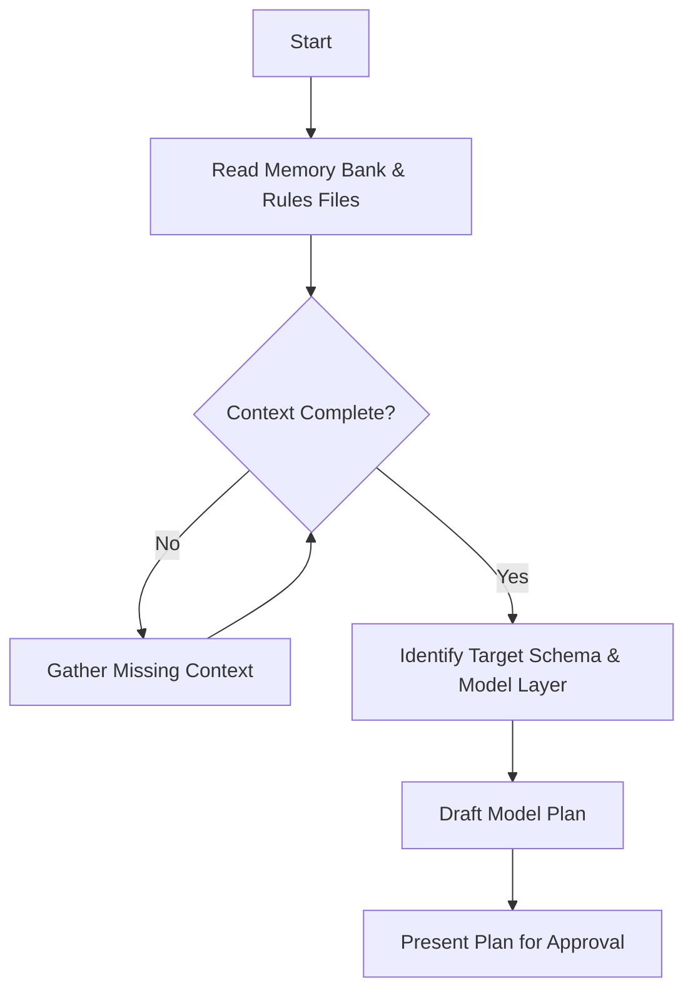
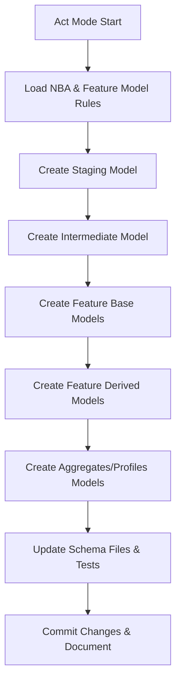

# dbt Model Creation Workflow

## Plan Mode

## Act Mode

## Detailed Steps

### Plan Mode

1. Read and verify all memory bank and rule files:
   - `.clinerules/nba_dbt_project_rules.mdc`
   - `.clinerules/feature_model_rules.mdc`
2. Confirm the prediction target grain (e.g., `for_player_game_prediction`) and entity context.
3. Identify required model layers and their count:
   - staging
   - intermediate
   - feature base
   - feature derived
   - feature aggregates/profiles
4. Draft a file and directory plan for each model:
   - Staging: `models/staging/<source>/stg_<source>__<entity>.sql`
   - Intermediate: `models/intermediate/<entity>/int_<entity>__<description>.sql`
   - Features:
     - Base: `models/features/<grain>/<entity>/base/feat_<entity>__base_<description>.sql`
     - Derived: `models/features/<grain>/<entity>/derived/feat_<entity>__derived_<description>.sql`
     - Aggregates/Profiles: `models/features/<grain>/feat_<grain>__<profile>_profile.sql`
5. Outline SQL structure:
   - Use CTEs: `source_data`, `filtered_records`, `calculations`, `final`
   - Decide on `materialized` setting, tags, and `unique_key` for incremental models
6. Present the plan for approval before execution.

### Act Mode

1. Load and apply the NBA and feature model rules.
2. Execute model creation per layer:
   - **Staging Model**
     - File: `models/staging/<source>/stg_<source>__<entity>.sql`
     - `{{ config(materialized='view') }}`, tags, CTE-based SQL
   - **Intermediate Model**
     - File: `models/intermediate/<entity>/int_<entity>__<description>.sql`
     - `{{ config(materialized='incremental', unique_key='...') }}`, tags
   - **Feature Base Models**
     - File: `models/features/<grain>/<entity>/base/feat_<entity>__base_<description>.sql`
     - `{{ config(materialized='view') }}` or `incremental`, tags
   - **Feature Derived Models**
     - File: `models/features/<grain>/<entity>/derived/feat_<entity>__derived_<description>.sql`
     - `{{ config(materialized='incremental') }}`, tags
   - **Aggregates/Profiles Models**
     - File: `models/features/<grain>/feat_<grain>__<profile>_profile.sql`
     - `{{ config(materialized='table') }}`, tags
3. For each model, write SQL with:
   - Clear CTE sections
   - Lowercase keywords, snake_case, explanatory comments
4. Update corresponding `schema.yml` files:
   - Add model and column descriptions
   - Define tests (unique key, primary/foreign keys, constraints) using `dbt_expectations`
5. Run `dbt compile` and `dbt build` to validate changes.
6. Commit and push changes with a clear message referencing the workflow steps.

### Post-Execution

- Verify no data leakage in feature aggregate/profile models.
- Update `.clinerules` or memory bank if new patterns or decisions emerge.
- Document next steps in `activeContext.md` and `progress.md` for continuity.
